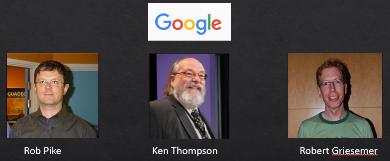

# 1.1 GO 起源及发展

Go语言最初由Google公司的**Robert Griesemer**、**Ken Thompson**和**Rob Pike**三个大牛于2007年9月开始设计发明，设计新语言的最初的洪荒之力来自于对超级复杂的C++11特性的吹捧报告的鄙视，最终的目标是设计网络和多核时代的C语言。到2008年中期，语言的大部分特性设计已经完成，并开始着手实现编译器和运行时，大约在这一年Russ Cox作为主力开发者加入。官方的发布是在2009年11月。到了2010年，Go语言已经逐步趋于稳定。2010年5月由Rob Pike公开的将其运用于google内部的一个后台系统。同年9月，Go语言正式发布并开源了代码。

Go是基于编译、垃圾收集和并发的编程语言。

图 1-1 Go 创始人

**Rob Pike**：曾是贝尔实验室Unix开发团队成员，Plan9操作系统开发的主要领导人，Inferno操作系统开发的主要领导人。

**Ken Thompson**：图灵奖得主，C语言前身B语言的作者，Unix的发明人之一， 操作系统Plan 9的主要作者，与Rob工同创造了UTF-8字符编码。

**Robert Griesemer**：曾为谷歌的V8 JavaScript引擎和Chubby开发代码。

图 1-2 Go语言基因族谱

首先看基因图谱的左边一支。可以明确看出Go语言的并发特性是由贝尔实验室的Hoare于1978年发布的CSP理论演化而来。其后，CSP并发模型在Squeak/NewSqueak和Alef等编程语言中逐步完善并走向实际应用，最终这些设计经验被消化并吸收到了Go语言中。业界比较熟悉的Erlang编程语言的并发编程模型也是CSP理论的另一种实现。

再看基因图谱的中间一支。中间一支主要包含了Go语言中面向对象和包特性的演化历程。Go语言中包和接口以及面向对象等特性则继承自Niklaus Wirth所设计的Pascal语言以及其后所衍生的相关编程语言。其中包的概念、包的导入和声明等语法主要来自于Modula-2编程语言，面向对象特性所提供的方法的声明语法等则来自于Oberon编程语言。最终Go语言演化出了自己特有的支持鸭子面向对象模型的隐式接口等诸多特性。

最后是基因图谱的右边一支，这是对C语言的致敬。Go语言是对C语言最彻底的一次扬弃，不仅仅是语法和C语言有着很多差异，最重要的是舍弃了C语言中灵活但是危险的指针运算。而且，Go语言还重新设计了C语言中部分不太合理运算符的优先级，并在很多细微的地方都做了必要的打磨和改变。当然，C语言中少即是多、简单直接的暴力编程哲学则被Go语言更彻底地发扬光大了（Go语言居然只有25个关键字，sepc语言规范还不到50页)）。

Go语言其它的一些特性零散地来自于其他一些编程语言；比如iota语法是从APL语言借鉴，词法作用域与嵌套函数等特性来自于Scheme语言（和其他很多编程语言）。Go语言中也有很多自己发明创新的设计。比如Go语言的切片为轻量级动态数组提供了有效的随机存取的性能，这可能会让人联想到链表的底层的共享机制。还有Go语言新发明的defer语句（Ken发明）也是神来之笔。

## [时间轴](https://golang.google.cn/doc/devel/release.html)

- _Go 1.15 2020/08/?_
- Go 1.14 2020/02/25
  - Go module 可用于生生产
  - defer 优化
  - goroutine 支持异步抢占
- Go 1.13 2019/09/03
  - sync.Pool improve
  - 重写逃逸分析
- Go 1.12 2019/02/25
  - 重写了 go vet。
- Go 1.11 2018/08/24
  - **[Go modules](https://blog.golang.org/using-go-modules)**
  - [WebAssembly](https://webassembly.org)
- Go 1.10 2018/02/16
  - build cache
- Go 1.9 2017/08/24
  - 别名支持
  - sync Map
- Go 1.8 2017/02/16
  - gc STW 优化
  - defer 优化
- Go 1.7 2016/08/15
  - 这个版本发布了 context 包 ，为用户提供了处理超时和任务取消的方法。
- Go 1.6 2016/02/17
  - 使用 HTTPS 时默认支持 HTTP/2。
- Go 1.5 2015/08/19
  - 对 gc 进行了重新设计。
  - 开始自举，go自编译。
- Go 1.4 2014/12/10
- Go 1.3 2014/06/18
- Go 1.2 2013/12/01
- Go 1.1 2013/05/13
- Go 1.0 2012/03/28
  - Go 的第一个版本。
- 2011/05/05：Google App Engine 支持 Go 语言
- 2010/05：谷歌投入使用
- 2010/01/08：当选 2009 年年度语言
- 2009/11/10：首次公开发布
- 2007/09/21：雏形设计
