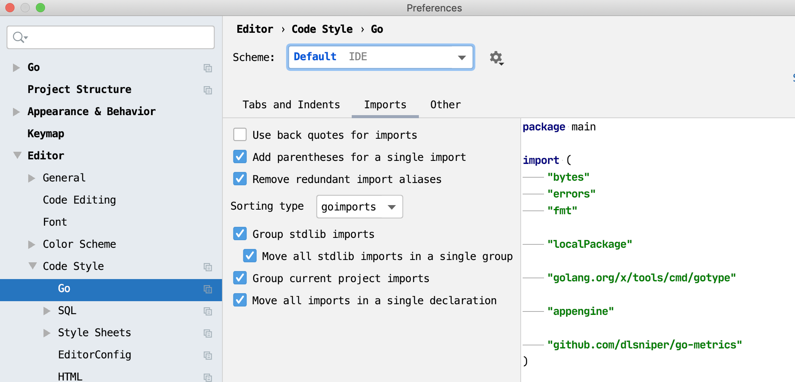

# 1.4 IDE 及配置

## IDE

>个人感觉比较适合Go的IDE

- [ATOM](https://atom.io/) ☆☆
- [VS Code](https://code.visualstudio.com/) ☆☆
- [GoLand](https://www.jetbrains.com/go/) ☆☆☆☆☆

## Goland 建议配置

>包导入顺序说明: 标准库包, 本地包(不建议)，golang包，初始化包，github

图 1-4 GoRoot 配置

_可以通过 Download SDK 方式下载配置特定版本的 **Go SDK**_。

图 1-5 Go Modules 配置

- SDK 请选择与 GOROOT 一致的配置
- `GOPROXY=https://goproxy.cn,https://goproxy.io,https://proxy.golang.org,direct`

图 1-6 Go Code Style imports 配置

图 1-7 Go Code Style other 配置

### Plugins

- ignore
- yaml
- Protobuf Support
- Bash Support
- Makefile Support
- .env files support
- Rainbow Brackets
